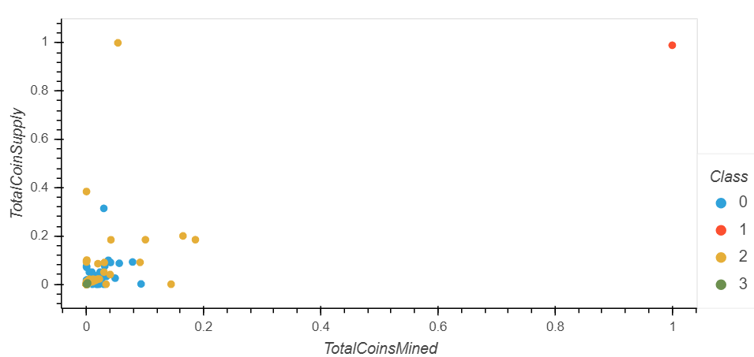

# Cryptocurrencies

### Overview: 
The client at Accoutabilty Accounting is looking to potentially offer a cryptocurrency investment portfolio for it customers. The purpose of our analysis was to use unsupervised learning to process cryptocurrency data from the cryptocompare website We were able to determine which coins were tradeable and also create a classification system for the coins.W used various processes and methods to accomplish the task. Please see the resulting visulaizations that were presented to the board.

#### Processes/Functions/Methods Used:
  * Python Pandas was used to preprocess the data, removing columns and transforming the data.
  * StandardScaler() function.
  * Principal component alogorithm (PCA) 
  * Elbow Curve
  * KMeans model
  * Hvplot

#### Visualizations Produced:

##### 3-D Scatter Plot

##### Hvplot Table

##### 2-D Scatter Plot

